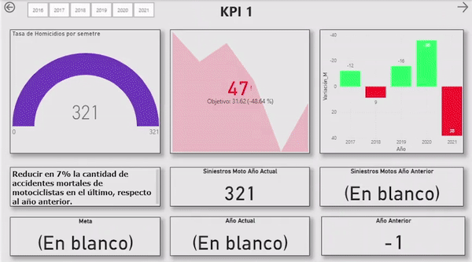
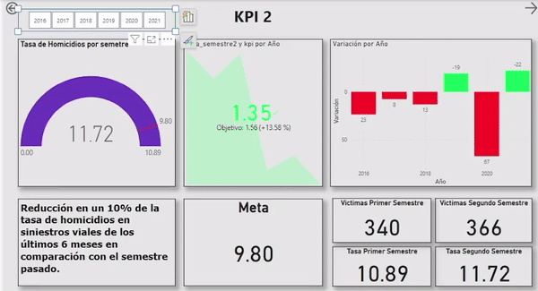

# Analisis de datos Siniestros Viales 

    
    

[Introducion](#Introducion) | [Datos](#Datos) | [KPI](#KPI) | [Dashboard](#Dashboard) | [Conclusiones](#Conclusiones) 

## Introducion

En el contexto de una ciudad dinámica como Buenos Aires, los siniestros viales representan un desafío constante que impacta tanto en la seguridad pública como en la calidad de vida de sus habitantes. Estos eventos, que abarcan desde colisiones entre vehículos hasta atropellos de peatones, tienen repercusiones que van desde daños materiales hasta pérdidas humanas irreparables. Este proyecto se centra en el análisis de datos relacionados con siniestros viales en Buenos Aires, con el objetivo de proporcionar información detallada y perspicaz para informar políticas públicas y medidas de seguridad que contribuyan a reducir la incidencia y las consecuencias de estos incidentes. Utilizando un conjunto de datos específico que abarca los años 2016-2021, se busca profundizar en la comprensión de estos eventos y así promover un entorno vial más seguro y protegido para todos los ciudadanos.

## Estructura del proyecto

- Archivos: Donde se guardan los dataset utilizado para este Proyecto
- img: Carpeta donde se guardan las imagenes utilizadas en el README
- Notebooks: Carpeta donde se guardan los notebooks de Jupyter utilizados para el análisis (EDA)
- README.md: Archivo de lectura que describe el proyecto

## Tecnologías utilizadas

         

## Datos

Los datos brindados fueron una hechos.csv con los datos de los acidentes desde 2016 a 2021 y lesiones.xlsx con los datos de 2019 a 2021 estos datos fueron pasados por un proceso de ETL ( extracción, transformación y carga ) y EDA ( análisis exploratorio de datos ) en  este proceso se revisaron valores nulos, outliers, duplicados se normalizaron los datos y se inputaron datos dependiendo del caso ya sea con la media o moda una vez hecho eso se procedio analizar los datos por medio de graficos para poder llegar un comprecion mas profunda   

## KPI 

Se realizaron los siguientes KPI

- *Reducir en un 10% la tasa de homicidios en siniestros viales de los últimos seis meses, en CABA, en comparación con la tasa de homicidios en siniestros viales del semestre anterior*.
  
  Definimos a la **tasa de homicidios en siniestros viales** como el número de víctimas fatales en accidentes de tránsito por cada 100,000 habitantes en un área geográfica durante un período de tiempo específico.
  Su fórmula es: 

$\frac{\text{Número de homicidios en siniestros viales}}{\text{Población total}} * 100000$  

  
- *Reducir en un 7% la cantidad de accidentes mortales de motociclistas en el último año, en CABA, respecto al año anterior*.
  
  Definimos a la **cantidad de accidentes mortales de motociclistas en siniestros viales** como el número absoluto de accidentes fatales en los que estuvieron involucradas víctimas que viajaban en moto en un determinado periodo temporal.
  Su fórmula para medir la evolución de los accidentes mortales con víctimas en moto es: 

$\frac{\text{Víctimas en moto del año anterior - Víctimas en moto del año actual}}{\text{Víctimas en moto del año anterior}}*100$ 
 

## Dashboard

Este dashboard de PowerBI se compone de cinco hojas, cada una enfocada en un aspecto diferente del análisis de accidentes de tránsito. A continuación, se detalla el contenido de cada una:

### Hoja 1: Presentación
- Descripción: Esta hoja actúa como la introducción al dashboard, proporcionando una visión general del análisis realizado.

### Hoja 2: Análisis por Ubicación

Descripción: En esta hoja se presenta un análisis detallado de los accidentes por ubicación geográfica. Incluye:

- Mapa de Formas: Muestra la saturación de víctimas por comuna.
- Mapa Corapletico: Muestra los Barios por comi¿una 
- Mapa de Puntos: Indica las ubicaciones de todos los accidentes con coordenadas X e Y.
- Gráfico de Barras: Compara la cantidad de accidentes por comuna.
- Gráfico de Torta: Representa los tipos de calle basados en los accidentes ocurridos.
- Gráfico de Área: Ilustra los accidentes por fecha a lo largo de los meses.
- Filtro por Año: Permite filtrar los datos por año específico.
- Tarjeta: Indica el número total de accidentes.

### Hoja 3: Análisis de Víctimas No Mortales

Descripción: Esta hoja se enfoca en el análisis de víctimas no mortales, las cuales son significativamente más numerosas, llegando a 37 mil. Incluye:

- Gráfico de Torta: Desglosa las víctimas por género.
- Gráfico de Área: Muestra la cantidad de víctimas por mes.
- Gráfico de Anillo: Representa el rango etario de las víctimas.
- Gráfico de Barras: Compara las víctimas por franja horaria.
- Gráfico de Barras: Mustra el top 5 de víctima mas comunes(peatón, conductor de moto, automóvil, etc.).
- Matriz: Muestra las víctimas por día y semana del año.
- Tarjeta: Indica el número total de víctimas no mortales.

### Hoja 4: KPI de Reducción de Accidentes Mortales

Descripción: Esta hoja presenta un KPI que muestra el objetivo de reducir en un 10% los accidentes mortales, basado en el primer trimestre del año. Se aplica a todos los años de los datos para verificar el cumplimiento anual. Incluye:

- Tarjetas: Muestran la tasa y el número de víctimas de cada semestre.
- KPI
- Grafico de Barras con las variacion entre el KPI y el resultado real

### Hoja 5: KPI de Reducción de Víctimas Mortales de Motos

Descripción: En esta hoja se presenta un KPI con el objetivo de reducir en un 7% las víctimas mortales de accidentes de motos, basado en el año anterior. Incluye:
- Tarjetas: Muestran el número de víctimas del año actual y el KPI.
- KPI
- Grafico de Barras con las variacion entre el KPI y el resultado real

Todas las hojas del dashboard cuentan con un filtro por año para permitir un análisis detallado y específico por períodos.

## Conclusiones

- Los siniestros viales con patrones destacados son la hora de la mañana, la edad de 20 a 35 años y el trimestre más crítico siendo el cuarto por las fiestas.

- Los motociclistas son las principales víctimas, con la comuna 1 y la zona sur de Buenos Aires registrando la mayor cantidad de accidentes.

- La General Paz es la calle con más accidentes, y las avenidas son las más peligrosas, representando el 61.64% de los siniestros.

- La disminución de los siniestros a partir de 2019, con un mínimo en 2020, esta relacionada con la pandemia de COVID-19.

- El día de la semana con mas siniestros el el viernes y la mayoría de los accidentes son en los cruces

## Gracias por llegar hasta aqui

## Desarrolladores

| [ Michael Martinez](https://github.com/bkmay1417) |
| :---: |

Copyright (c) 2024 [Michael Martinez] yam8991@gmail.com
